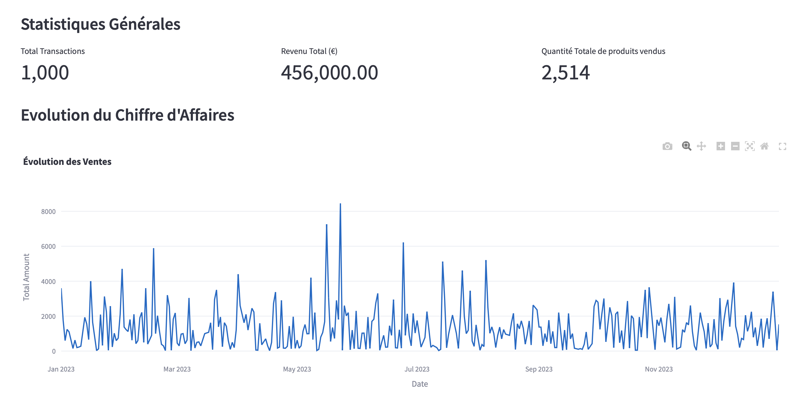
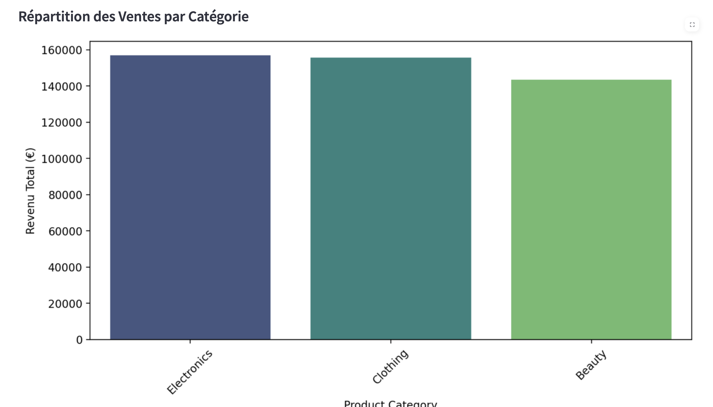
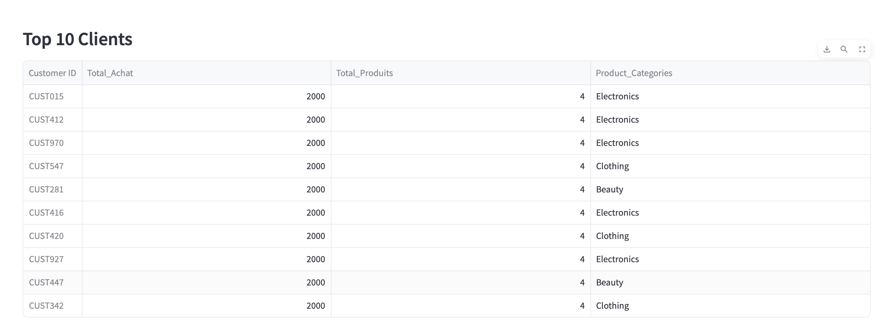

# Analyse des Transactions de Vente avec Streamlit

## Description du Projet
Ce projet est une application interactive développée avec **Streamlit**, permettant d'analyser un dataset de transactions de vente. L'application permet aux analystes de données et aux gestionnaires de commerce de mieux comprendre les tendances de vente, le comportement des clients et les performances des produits.

## Fonctionnalités Principales
✅ Importation et affichage des données CSV

✅ Analyse du chiffre d'affaires total et des transactions

✅ Visualisation des ventes par catégorie de produit

✅ Analyse du profil des clients (âge, genre, comportement d'achat)

✅ Classement des meilleurs clients avec leurs catégories de produits achetées

✅ Suivi de l'évolution des ventes au fil du temps

## Structure des Données
Le fichier CSV doit contenir les colonnes suivantes (Cf: data/reatail_sales_dataset.csv) :

| Colonne           | Description |
|------------------|-------------|
| Transaction ID   | Identifiant unique de la transaction |
| Date            | Date de la transaction (format YYYY-MM-DD) |
| Customer ID     | Identifiant unique du client |
| Gender          | Sexe du client (Male/Female) |
| Age             | Âge du client |
| Product Category| Catégorie du produit acheté |
| Quantity        | Nombre d'unités achetées |
| Price per Unit  | Prix unitaire du produit |
| Total Amount    | Montant total de la transaction |

## 🛠️ Installation et Lancement
1. **Cloner le projet**
```bash
git clone https://github.com/aiMBF/steamlit-app.git
cd streamlit-app
```

2. **Installer les dépendances**
```bash
pip install -r requirements.txt
```

3. **Lancer l'application Streamlit**
```bash
streamlit run app/app.py
```

4. **Importer un fichier CSV** depuis l'interface et commencer l'analyse !

## Exemples de Visualisations
- **Graphique des ventes au fil du temps** (courbe d'évolution du chiffre d'affaires) 

- **Répartition des ventes par catégorie de produit** (barres ou pie chart)

- **Profil des clients** (distribution des âges et genre)
- **Top 10 clients** avec leurs dépenses et catégories de produits achetées

